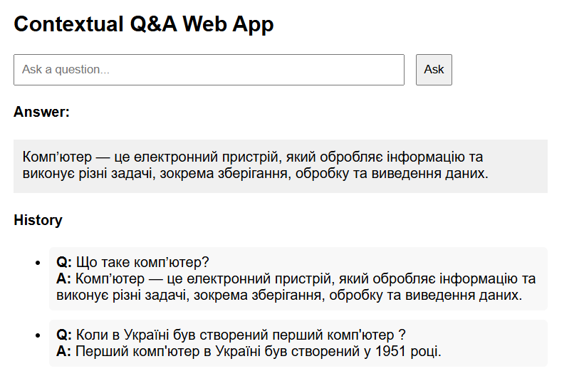

# Contextual Q&A Web App

A FastAPI + OpenAI-powered application that answers questions using context loaded from a PDF specified in `.env` (`DOWNLOAD_PDF`).
Frontend: pure HTML/JS/CSS. Backend: FastAPI, OpenAI, SQLite for Q&A history.

---

## Project Structure

```
qa_docs/
├── backend/
│   ├── main.py
├── frontend/
│   ├── index.html
│   ├── script.js
│   └── style.css
├── tests/
│   └── test_main.py
├── requirements.txt
├── lecture.pdf
├── .env.example
├── .env
├── faq.db
├── pytest.ini
└── README.md
```

---

## How to run

### 0. Requirements

- Python 3.11+
- OpenAI API key
- PDF file for context (e.g., `lecture.pdf`)

### 1. Environment

1. Copy `.env.example` to `.env` and set your variables:
    ```
    OPENAI_API_KEY=your_openai_api_key_here
    DOWNLOAD_PDF=./lecture.pdf
    ```

2. Place your PDF at the path specified in `.env` (`./lecture.pdf` by default).

---
### 2. Backend

1. Install dependencies:
    ```sh
    python -m venv venv
    source venv/bin/activate # On Windows use `venv\Scripts\activate`
    pip install -r requirements.txt
    ```

2.  Start the backend:
    ```sh
    uvicorn backend.main:app --reload
    ```

3.  Read docs of backend API in your browser:
   ```sh
       http://127.0.0.1:8000/docs
   ```

---
### 3. Frontend

1. Open [`frontend/index.html`](frontend/index.html) in your browser.
2. Enter a question in the input "Asc your question..." field and click "Ask" button.

---

### 4. Tests

1. Start tests of the backend:
    ```sh
         pytest tests/test_main.py -v
    ```

---
## Example of the application in operation



---
## Notes

- On startup, backend loads and chunks the PDF.
- If PDF is missing or invalid, API will return an error.
- SQLite (`./faq.db`) logs all questions and answers.
- All configuration is via `.env` in the project root.

---

# ✅ What is Already Implemented

## Q&A History (No Authentication)
- The question-answer history is saved in the database (`qa_history`).
- It can be accessed via the `/api/history` endpoint.
- There is no user/session/role association yet.

## PDF Chunking
- The uploaded PDF is split into fixed-size chunks with overlap.
- Chunks are loaded at application startup.

## Basic Chunk Search
- Relevance is determined by word overlap between the question and chunks.
- Top-3 most relevant chunks are selected.

## FastAPI + CORS
- Modern web backend ready for frontend integration.

## OpenAI Integration
- The user’s question and retrieved context are sent to an LLM (GPT-4o-mini).

## Missing PDF Handling
- A special response is returned if no PDF has been uploaded.

---

# 🔄 What from the Future Work is Partially Implemented?

## Improved Context Filtering
- Basic keyword-based search is implemented, but no reranking or semantic search yet.

## Preprocessing and Embedding Optimization
- Basic chunking is implemented, but no advanced optimization or embeddings are used yet.

---

# 💡 What Can Be Added Next?

## 1. Provide Docker configuration

- Create a `Dockerfile` to define how the app is built and run in a container.
- Create a `docker-compose.yml` to orchestrate services, manage environment variables, and persist data.

## 2. User Authentication & Session Persistence
- Implement user registration, login, and JWT tokens.
- Store `user_id`, `timestamp`, and `role` in the history table.

## 3. Improved Context Filtering
- Use embeddings (e.g., OpenAI Embeddings or Sentence Transformers) to find semantically similar chunks.
- Add reranking (e.g., additional LLM scoring pass).

## 4. Feedback Loop and Learning
- Add 👍/👎 buttons to each answer.
- Save and analyze feedback in a `feedback` table.

## 5. Multilingual Support
- Automatically detect question language (e.g., using `langdetect`).
- Translate questions, context, and answers if needed.

## 6. Retrieval Analytics Dashboard
- Collect statistics: most returned chunks, top questions, average response time, relevance score.
- Create a dedicated endpoint or frontend for analytics.

## 7. Zero-Shot Chunk Generation
- If no relevant chunk is found, generate a "virtual" chunk via LLM paraphrasing or augmentation.

## 8. Preprocessing and Embedding Optimization
- Use more intelligent chunking (based on PDF structure, sections, or chapters).
- Add embeddings for fast semantic retrieval.

## 9. Scalability Enhancements
- Use Uvicorn/Gunicorn for production deployment.
- Move OpenAI API requests to a separate microservice or queue.
- Add caching and load balancing mechanisms.
---